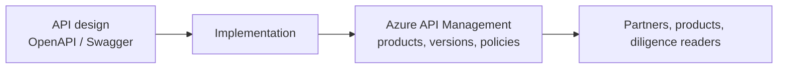

# BrodyBooks

Published writing from Daniel Brody, fractional CTO. The book in this repository is the practical guide. The engagements at [CTO Rescues](https://ctorescues.com/) are where the same material is applied to a live platform.

[GitHub profile](https://github.com/dzbrody) · [Books on the site](https://ctorescues.com/books/) · [Book a call](https://ctorescues.com/contact/)

## The book

**Mastering API Management with Swagger**

A practical guide to designing, building, and governing enterprise APIs with Swagger / OpenAPI and Azure API Management. Written for architects, developers, and product leaders who need APIs that scale, comply, and show up as business value.

Read it here: [mastering-api-with-swagger.md](mastering-api-with-swagger.md)

A rendered companion page is on the site: [ctorescues.com/book-mastering-api-with-swagger](https://ctorescues.com/book-mastering-api-with-swagger/).

Two further books are in progress and are not in this repository yet:

- *The Fractional CTO Playbook* — onboarding, technical assessment, executive communication, and exit.
- *Technology Strategy for Capital Events* — M&A, fundraising, and board-level technology narrative.

## Problem

Companies accumulate APIs the way they accumulate features. The contract drifts, the gateway policies are tribal knowledge, and the investment memo still says "we have an API platform." Buyers, regulators, and the next engineering leader inherit a surface nobody can draw.

## Solution

The book walks the path from an OpenAPI contract to a governed Azure API Management estate: design, build, and the management decisions that keep the estate coherent. This repository publishes the manuscript in Markdown under the Apache License 2.0 so a team can read it next to their own spec.



The diagram is the argument of the book, not a deployable stack. There is no infrastructure code in this repository. A minimal service that pairs with the book is [SimpleAPI](https://github.com/dzbrody/SimpleAPI).

## Getting started

The manuscript is a single Markdown file.

```bash
git clone https://github.com/dzbrody/BrodyBooks.git
cd BrodyBooks
# open mastering-api-with-swagger.md
```

Any Markdown reader works. For the author context and the current publication status, use the [books page](https://ctorescues.com/books/) rather than older links.

## Use cases for a CTO engagement

- **Product commercialization.** Put a governed API contract in front of partners and a future acquirer.
- **Technical due diligence.** Give investors a vocabulary for what "API management" should already look like in the target.
- **Engineering leadership.** Train architects and lead developers on Swagger and Azure API Management without waiting for a workshop.
- **Exit preparation.** Turn an informal integration surface into something that can be described in a memo.

## Tech stack

The subject matter of the book, not a runtime in this repo:

- OpenAPI / Swagger
- Azure API Management
- Enterprise API design and governance

## License and contributions

This repository is licensed under the [Apache License 2.0](LICENSE). Copyright Daniel Brody.

Corrections to the manuscript are welcome as pull requests against `mastering-api-with-swagger.md`: broken examples, outdated Azure API Management behavior, and unclear passages. Scope changes to the book's argument belong in a conversation first.

## About the author

Daniel Brody is an enterprise CTO and CIO with 30+ years leading technology in financial services, healthcare, gaming, and enterprise SaaS. He has taken platforms through turnaround, modernization, and exit, and he holds patents in digital systems and data architecture. CTO Rescues is his fractional practice for founders, CEOs, boards, and investors.

Earlier copies of this README pointed at brody.ca. The current site is [ctorescues.com](https://ctorescues.com/).

## Work with me

The book is the framework. An engagement applies it to your gateway, your partners, and the transaction in front of you.

[Book a Fractional CTO call](https://ctorescues.com/contact/) · [LinkedIn](https://www.linkedin.com/in/danielbrody/) · [Case studies](https://ctorescues.com/casestudy/) · [GitHub profile](https://github.com/dzbrody)


---
**CITO for Hire** — design-it · sell-it · build-it · implement-it
[ctorescues.com](https://ctorescues.com) · [Facebook](https://www.facebook.com/people/CTORescues/100067231596849/) · [GitHub](https://github.com/dzbrody) · [LinkedIn](https://www.linkedin.com/in/danielbrody/)
